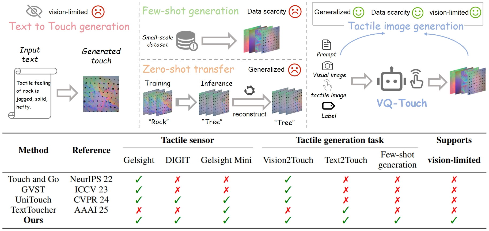
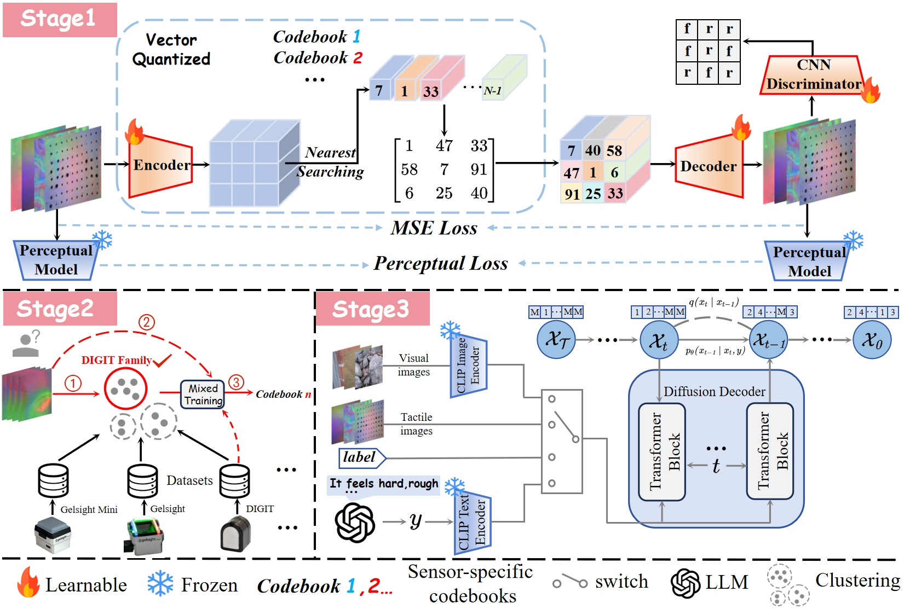

# VQ-Touch: A Unified Few-Shot Tactile Generation Framework Across Sensors and Scenarios

✨Official Implementation of VQ-Touch in PyTorch.

📢We will release the code once the paper is accepted. Stay tuned!!!🚀

## 📖Abstract
Tactile image generation significantly reduces reliance on costly, wear-prone sensors by synthesizing high-fidelity tactile data, providing an efficient solution for tactile information acquisition in robotic perception and human-machine interaction systems. However, existing methods rely on large-scale multimodal datasets and lack text-to-touch generation capability, struggling in vision-limited environments. We introduce VQ-Touch, which, to the best of our knowledge, is the first few-shot tactile generation framework supporting cross-sensor and multi-scenario applications. To extract complex deformation and texture features from limited data, we propose DM-VQGAN, an efficient tactile representation learner. Furthermore, we introduce a discrete diffusion decoder with a unified condition interface, supporting text, images, and labels for diverse multimodal generation tasks. We enhance model generalizability through clustering and few-shot mixed training, achieving compatibility with current mainstream sensors and their variants. Experiments demonstrate that VQ-Touch surpasses state-of-the-art work in multiple tasks.

## 🔍The illustration of tactile generation tasks and the application range comparison of diffrent methods.

  

The illustration of tactile generation tasks and the application range comparison of different methods. VQ-Touch effectively supports several tactile generation tasks, including few-shot generation, zero-shot transfer, text-to-touch generation, and vision-to-touch generation, and is applicable to most mainstream tactile sensors (e.g., GelSight, DIGIT, and GelSight Mini). Under conditions of data scarcity and vision limitations, VQ-Touch remains usable, demonstrating significant general advantages over existing methods.

## 🛠️Overview of the proposed VQ-Touch framework.

  

The framework consists of three stages:(1) learning efficient tactile features using the DM-VQGAN encoder-decoder architecture, which is based on discrete codebooks for representation, (2) acquiring sensor-family-specific codebooks through clustering and few-shot mixed training method, and (3) by leveraging the discrete latent space and encoder learned by DM-VQGAN, a discrete diffusion decoder is employed to generate high-quality tactile images conditioned on unimodal inputs including visual images, tactile images, textual descriptions, or semantic labels.

## ✅ Requirements
This project has been thoroughly tested on:

🔥 PyTorch 2.5.1

🖥️ CUDA 12.8
